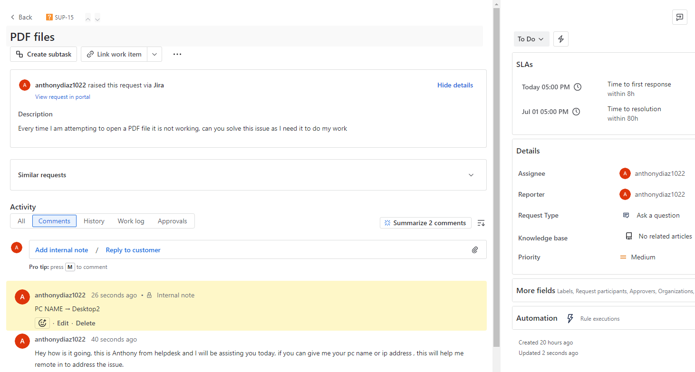
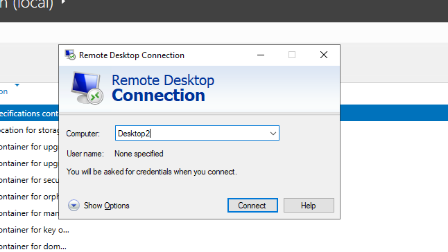
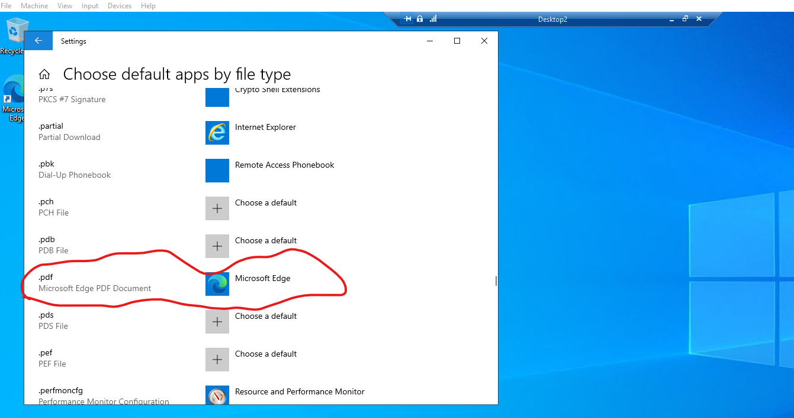
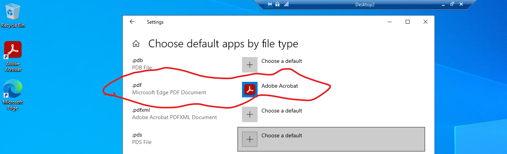
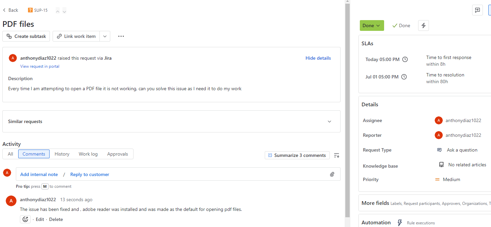

# 🛠️ Ticket Resolution: PDF Files Not Opening (SUP-15)

## 🎯 Request Summary

- User: Clark Kent

- PC Name: Desktop2

- Issue: User reported being unable to open any PDF files, which was interfering with work tasks.

🧩 Issue Diagnosis

1. User was greeted and asked to provide the PC name.

3. Remoted into Desktop2 using Remote Desktop Connection.

4. Navigated to Settings > Default Apps by File Type.

5. Discovered

   - .pdf files were associated with Microsoft Edge.

   - Adobe Acrobat Reader was not installed on the system.
  

🛠️ Resolution Steps

1. Installed Adobe Acrobat Reader on the user’s machine.

2. Set Adobe Acrobat Reader as the default app for .pdf files.

3.Verified the default file type change in Settings.

✅ Confirmation & Closure

- The user’s PDF files successfully opened with Adobe Reader.

- Communicated the fix to the user.

- Ticket marked as resolved and closed.

